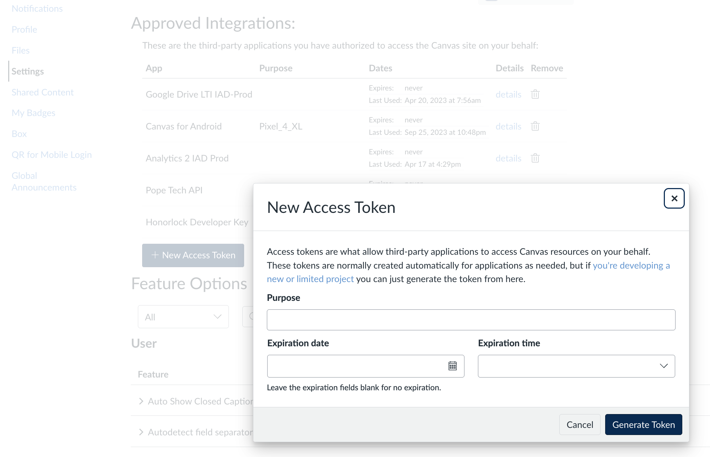

# canvas-gradebook

Grabs the canvas gradebook once a day and computes statistics

## Installation

```sh
npm clone https://github.com/leesjensen/canvas-gradebook.git
npm install
```

## Configuration

### Access token

Get a Canvas API Access Token.

1. Open Canvas
1. Open your profile by clicking on your user image
1. Select `Settings`
1. Select `+ New Access Token`



### Config.js

Create a `config.js` file in the root of the project. Replace the values given below with your Canvas URL, course, and API Access Token.

```js
export default {
  canvas: {
    url: 'https://canvas.instructure.com/api/v1',
    course: '99999',
    token: 'xyz',
  },
};
```

### Execute

Run `node main.js`. This will produce a CVS file containing a summary of submission information for the current grade book. Each time you run it, it will add the latest submission summary for each assignment.

```csv
"date","assignment","submissionPercent","latePercent","averageGrade"
"5/16/2025, 8:39:11 AM","Demo day submission",0.28,0.04,0
"5/16/2025, 8:39:11 AM","Startup CSS",0.88,0.2,0.83
"5/16/2025, 8:39:11 AM","Startup HTML",0.91,0.23,0.85
"5/16/2025, 8:39:11 AM","Startup DB",0.76,0.39,0.69
"5/16/2025, 8:39:11 AM","Startup React Phase 1: HTML/CSS",0.83,0.24,0.79
"5/16/2025, 8:39:11 AM","Startup Service",0.81,0.42,0.73
"5/16/2025, 8:39:11 AM","Startup WebSocket",0.69,0.25,0.61
"5/16/2025, 8:39:11 AM","Startup specification",0.94,0.1,0.92
"5/16/2025, 8:39:11 AM","Startup React Phase 2: Interactivity",0.82,0.27,0.76
"5/16/2025, 8:39:11 AM","Startup AWS",0.93,0.11,0.91
"5/16/2025, 8:39:11 AM","Student Rating Submission",1,0,0
"9/4/2025, 12:11:18 PM","Demo day submission",0.28,0.04,0
"9/4/2025, 12:11:18 PM","Startup CSS",0.88,0.2,0.83
"9/4/2025, 12:11:18 PM","Startup HTML",0.91,0.23,0.85
"9/4/2025, 12:11:18 PM","Startup DB",0.76,0.39,0.69
"9/4/2025, 12:11:18 PM","Startup React Phase 1: HTML/CSS",0.83,0.24,0.79
"9/4/2025, 12:11:18 PM","Startup Service",0.81,0.42,0.73
"9/4/2025, 12:11:18 PM","Startup WebSocket",0.69,0.25,0.61
"9/4/2025, 12:11:18 PM","Startup specification",0.94,0.1,0.92
"9/4/2025, 12:11:18 PM","Startup React Phase 2: Interactivity",0.82,0.27,0.76
"9/4/2025, 12:11:18 PM","Startup AWS",0.93,0.11,0.91
"9/4/2025, 12:11:18 PM","Student Rating Submission",1,0,0
```

If you want to have the report run once a day then include the `repeat` parameter.

```sh
node main.js --repeat
```

### Analyze

Open the CSV in your favorite editor and enjoy.


