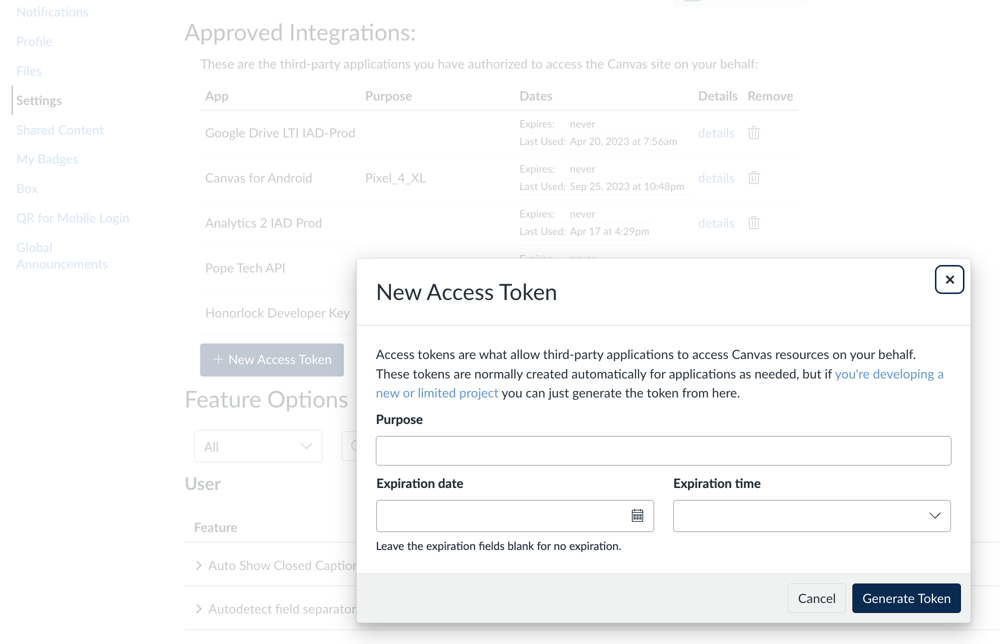
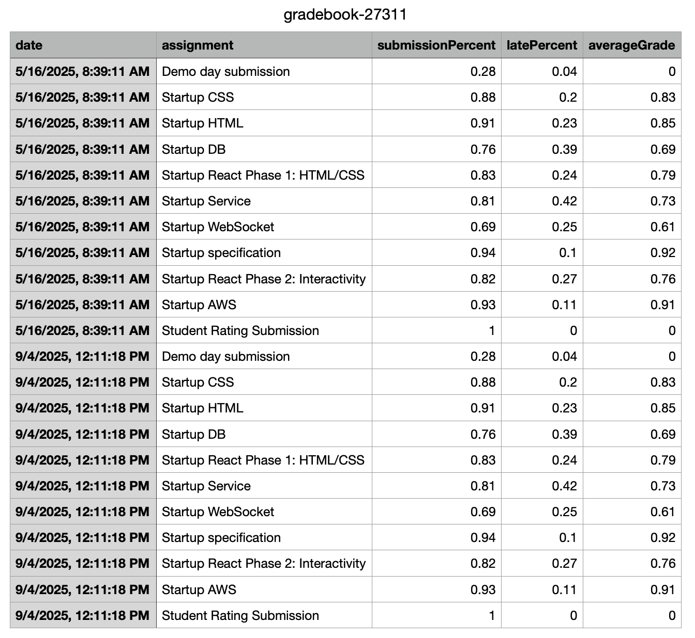

# canvas-gradebook

Grabs the canvas gradebook and generates submission statistics.

## Installation

```sh
npm clone https://github.com/leesjensen/canvas-gradebook.git
npm install
```

## Configuration

### Access token

Get a Canvas API Access Token.

1. Open Canvas
1. Open your profile by clicking on your user image
1. Select `Settings`
1. Select `+ New Access Token`



### Config.js

Create a `config.json` file in the root of the project. Replace the values given below with your Canvas URL, course, and API Access Token.

```js
{
  "courseUrl": "https://byu.instructure.com/api/v1/courses/555",
  "startDate": "2026-01-01",
  "endDate": "2026-04-25",
  "apiKey": "tokenhere",

  "includeAssignments": ["Startup specification", "Startup AWS", "Startup HTML", "Startup CSS", "Startup React Phase 1: React Routing", "Startup React Phase 2: Reactivity", "Startup Service", "Startup DB", "Startup WebSocket"]
}

```

### Execute

Run `node main.js`. This will produce a CVS file containing a summary of submission information for the current grade book. Each time you run it, it will add the latest submission summary for each assignment.

```csv
"Date", "Startup AWS", "Startup CSS", "Startup DB", "Startup HTML", "Startup React Phase 1: React Routing", "Startup React Phase 2: Reactivity", "Startup Service", "Startup WebSocket", "Startup specification"
"Jan/01/2026", 0, 0, 0, 0, 0, 0, 0, 0, 0
"Jan/02/2026", 0, 0, 0, 0, 0, 0, 0, 0, 0
"Jan/03/2026", 0, 0, 0, 0, 0, 0, 0, 0, 0
"Jan/04/2026", 0, 0, 0, 0, 0, 0, 0, 0, 0
"Jan/05/2026", 0, 0, 0, 0, 0, 0, 0, 0, 0
"Jan/06/2026", 0, 0, 0, 0, 0, 0, 0, 0, 0
"Jan/07/2026", 0, 0, 0, 0, 0, 0, 0, 0, 1
"Jan/08/2026", 1, 0, 0, 0, 0, 0, 0, 0, 2
"Jan/09/2026", 1, 0, 0, 0, 0, 0, 0, 0, 7
```

### Analyze

Open the CSV in your favorite editor and enjoy.


